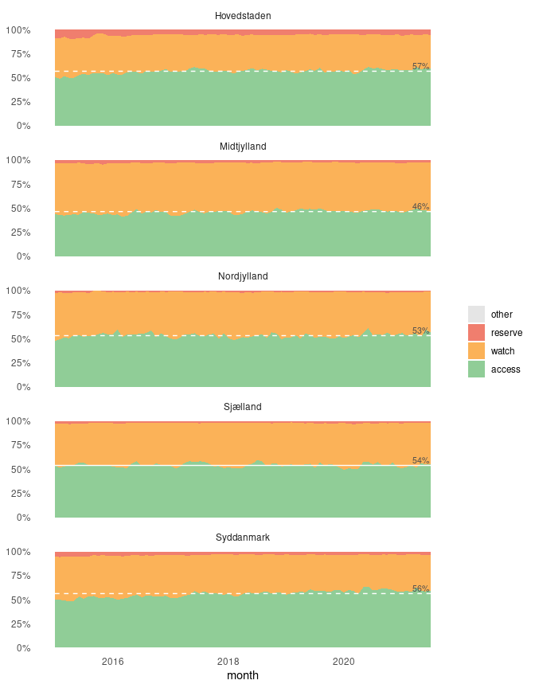

<!-- README.md is generated from README.Rmd. Please edit that file -->

# abxaware

<!-- badges: start -->
<!-- badges: end -->

The goal of abxaware is to help aggregate and plot antibiotic usage data
in accordance with the WHO AWaRe classification.

## Installation

You can install the development version from
[GitHub](https://github.com/) with:

``` r
# install.packages("devtools")
devtools::install_github("anhoej/abxaware", 
                         build_vignettes = TRUE)
```

To get started, read the vignette:
<https://anhoej.github.io/abxaware/articles/abxaware.html>.

## Example

To create a plot of antibiotic use in Danish hospitals from the included
dataset `abx_sales` run this:

``` r
library(abxaware)

awr_plot(abx_sales,
         atc, 
         ddd, 
         time = month, 
         unit = region, 
         ncol = 1)
#> Aggregating data using the "dk" AWaRe classification
```

<!-- -->
